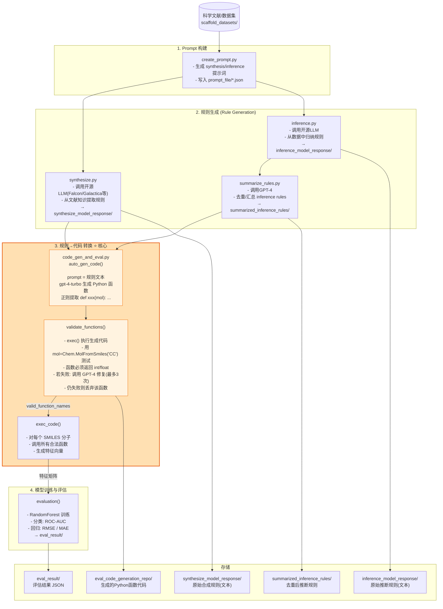
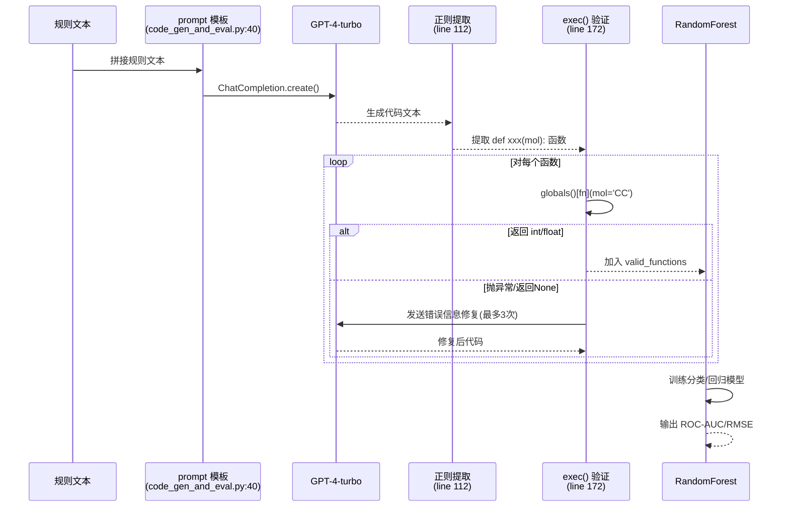

# LLM4SD Codebase Architecture

## 核心流程图



---

## 规则→代码 关键函数详解



---

## 文件结构

```
LLM4SD/
├── create_prompt.py          # 生成 prompt 模板
├── synthesize.py             # 文献知识 → 规则(开源LLM)
├── inference.py              # 数据归纳 → 规则(开源LLM)
├── summarize_rules.py        # 规则去重(GPT-4)
├── code_gen_and_eval.py      # ⭐ 规则→代码 + 评估(GPT-4)
├── eval.py                   # 独立评估脚本
│
├── run_others.sh             # 主流程: bbbp/bace/clintox/...
├── run_tox21.sh              # tox21 流程
├── run_sider.sh              # sider 流程
├── run_qm9.sh                # qm9 流程
│
├── llm4sd_models.json        # RandomForest 超参数配置
├── prompt_file/
│   ├── synthesize_prompt.json
│   └── inference_prompt.json
│
├── scaffold_datasets/        # 数据集 (bbbp/bace/tox21/...)
├── synthesize_model_response/  # 合成规则原始输出
├── inference_model_response/   # 推断规则原始输出
├── summarized_inference_rules/ # 去重后规则
├── eval_code_generation_repo/  # GPT-4 生成的Python函数
└── eval_result/                # 最终评估结果
```

---

## 关键技术点

| 组件 | 技术 |
|------|------|
| 规则生成 LLM | Falcon-7b/40b, Galactica-6.7b/30b, ChemLLM-7b, ChemDFM-13B |
| 代码生成 LLM | GPT-4-turbo (`auto_gen_code`, line 94) |
| 规则去重 LLM | GPT-4 (`summarize_rules.py`) |
| 分子描述符 | RDKit, Mordred |
| 下游分类/回归 | scikit-learn RandomForest |
| 代码验证 | Python `exec()` + dummy mol 测试 |
